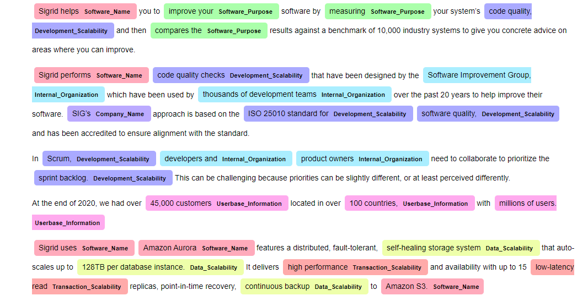

# Repository details
This repository contains the results and code contributions of the thesis: 
__SE_Master_Project_Final_Draft_Athul_Nambiar.pdf__.

The sections of this README are organized based on the directory names 
providing brief explanations as to what each each folder is about.

## Dataset prepraration and ALBERT
In this directory we provide the notebooks used to prepare the Software Context Dataset in the correct format.
We also provide the notebook to train our dataset on the ALBERT model and evaluate the results.
This was used to check our annotation guidelines when constructing our dataset.

### SC NER Dataset version 2
Contains 5 iterations of our Software Context Dataset in the BIO tagged scheme. The original JSONL export from doccano
is always available.

## Preannotated Data
In this directory we save all the sources and the data we collected for our dataset. 
The directories that end with "_Data" contain two files, one "...Data.txt" and one "...Sources.txt".
The "...Data.txt" contains all the unlabelled text data that is used for our dataset. The "...Sources.txt" correspond to the 
sources where the "...Data.txt" data was collected from.
The directories that end with "_Start_URL" contain all the potential sources we could use to collect data for our dataset.
Note that the filenames in these directories are the queuries we used with the Google API, and the urls in the documents are
the first 10 results from the Google API. The directories that end with "_Start_URL" are not that relevant as the majority of the sources are not used 
for our dataset. The sources that are used in the data of our dataset are explicetly stated in the "...Sources.txt" files in
the directories that end with "_Data".

## Software Context Ontology
This directory contains all our OWL ontologies in turtle syntax.
### Before_OOPS
This contains the ontology before we used the OOPS! Scanner to make corrections to our ontology.
### After_OOPS
This contains the ontology after we used the OOPS! Scanner to make corrections to our ontology.
The results of the OOPS! scanner are also available.

## SCNER and SCKG
This directory contains all the code required to apply the SCNER approach discussed in our thesis.
The code within this directory is based on this repository, based on the reference paper we studied in our research: ["Few-Shot Named Entity Recognition: A Comprehensive Study" paper repository](<https://github.com/few-shot-NER-benchmark/BaselineCode>).

For all the pretrained models: <a href="https://drive.google.com/drive/folders/1Lkpxv3J6danaSYBiswDBYBqx74LXinlG?usp=drive_link" title="Optional title">Click here</a>.
The _lc_pretrained_190.pt_ contains the original Roberta model that has Noisy Supervised Pretraining (NSP).
The rest of the models are the fine-tuned SCNER models for each 5-fold cross validation iteration. 

The _requirements.txt_ file contains all the libraries and versions to use the notebooks and python scripts in this directory.
All the pythons scripts are from the repository referenced above. The _LC training.ipynb_ file contains all the code required to
fine-tune the linear classifier with the RoBERTa model. To also apply NSP just load the pretrained model that was trained using NSP.
The code to evaluate the model is also available in this notebook.

_KG Construction.ipynb_ contains the code to build our Software Context Knowledge Graph (SCKG) based on the input text/documentation
that is provided to the model. It contains the code for all the rule-based relation mapping that defines all the edges between the KG nodes.

_NER Visualization.ipynb_ contains the code to use our fine-tuned NER model and visualize the the predicted entities in documentation.
We use displaCy to render the NER visualization. The following image is an example of what the visualization will look like:

## dataset/custom
Directory contains our 5-fold cross validation data in a structure where each line of the ".words" files corresponds
each line of its ".ner" counterpart. Basically ".words" contain the original sentence and ".ner" contains the sentences
labelled in the BIO tagging scheme.

## kg_tests
Contains the "sigrid_text.words" and "sigrid_text.ner" files for the documentation presented to experts during the evaluation and validation sessions of the SCKG.
This is explained in the thesis, but "sigrid_text.words" contains the document that is presented to experts, and is the input used
to construct our SCKG.

## results
Contains the training results during our 5-fold cross-validation implementation to train 5 versions of our
SCNER. The learning curves from these results can be graphed using the code present in the _LC training.ipynb_ notebook.